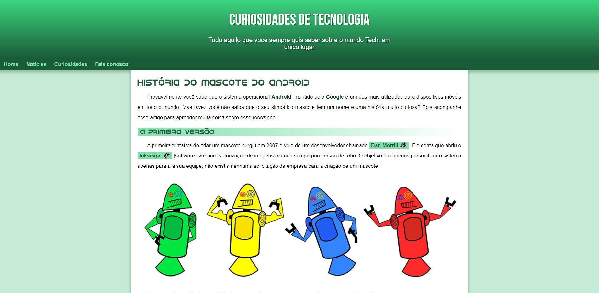

<h1 align="center"> Android </h1>

Projeto desenvolvido para teste de aprendizado.

  <a href="#-tecnologias">Tecnologias</a>&nbsp;&nbsp;&nbsp;|&nbsp;&nbsp;&nbsp;
  <a href="#-projetos">projetos</a>&nbsp;&nbsp;&nbsp;|&nbsp;&nbsp;&nbsp;
  <a href="#memo-licença">Licença</a>

  

 

## 🚀 Tecnologias 

- HTML e CSS
- Javascript
- Git e Github 

## 💻 Projeto

Feito para teste de aprendizado, contando curiosidades sobre o Android.

- [Acesse aqui o projeto online](https://klebsonamarantes.github.io/projeto-android)

## :memo: Licença

Esse projeto está sob a licença MIT.
